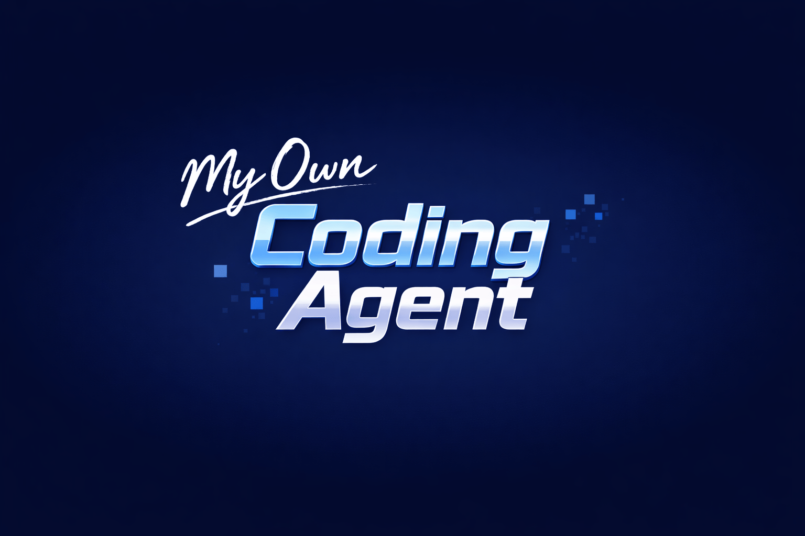

# My Own Coding Agent



An educational, expandable coding‑agent harness built in Python.

It started as a single‑file agent built from notes and experiments, and grew into a full learning playground inspired by Codex, Open Code, Claude Code, and Pi. The goal here is simple: **learn how these systems work by building one** and then expand it with more bells and whistles over time. It’s not the best, but it’s mine.

## Why this exists

I read a [couple](https://ampcode.com/how-to-build-an-agent) of [posts](https://ghuntley.com/agent/) on building agents that made me want to own the full harness—not just use a product. I wanted something I could understand end‑to‑end, tweak freely, and grow as I learned. This project is the result: a readable, hackable agent loop with modular pieces I can keep expanding.

This is also a unique project in that it is self‑bootstrapped: I built the initial agent using Codex, then added the tools and loop needed for it to help build itself. Most new features I add now are developed with the agent itself.

## What it provides

- Provider‑agnostic LLM support (OpenAI native, Anthropic native, and OpenAI‑compatible APIs)
- Streaming text + tool calls + thinking blocks
- Session persistence (JSONL) with forking and resuming
- Context compaction to stay inside token limits
- Skills system (Markdown + YAML frontmatter)
- Prompt templates with slash commands and argument substitution
- Extensions API (events, custom tools, custom commands)
- Interactive TUI (Textual) + headless CLI mode
- Config layering (global, project, env vars)
- Built‑in tool suite: read/write/edit/bash/grep/find/ls

## The agent loop in five steps

1. **Input intake & preprocessing**
   - Slash commands and templates (`/something`), skills (`$skill`), and input extensions are resolved before anything hits the model.
2. **Session + context guardrails**
   - The user message is persisted to the JSONL session; context is compacted if needed.
3. **Prompt construction & model stream**
   - System prompt is built from tools + skills + context files; model response streams back events.
4. **Tool execution cycle**
   - Tool calls are parsed, validated, executed, and tool results are appended back into the conversation.
5. **Turn finalization**
   - Events are emitted, messages are persisted, and token stats are updated.

## High‑level architecture

```
core/        Agent loop, sessions, context compaction, prompts
llm/         Provider adapters + streaming events
tools/       Built‑in tool registry + implementations
skills/      Skill discovery + validation
prompts/     Prompt templates + argument expansion
extensions/  Hooks + custom tools/commands
tui/         Textual UI (interactive mode)
cli.py       Headless CLI entry point
```

## Quickstart

Requirements: Python 3.14+ and `uv`.

```bash
make deps
make run
```

Headless (single prompt):

```bash
make run-headless PROMPT="List all Python files"
```

## Development

```bash
make test
make lint
make format
```

Release check (lint + tests):

```bash
make can-release
```

## Built‑in tools

- `read` – read file contents with line numbers
- `write` – create/overwrite files
- `edit` – find/replace edits
- `bash` – run shell commands
- `grep` – regex search across files
- `find` – glob‑based file discovery
- `ls` – directory listings

## Skills

Skills are Markdown files with YAML frontmatter. Invoke them with `$skill-name` to inject curated instructions into the prompt. Skill discovery respects user, project, and custom directories (see `docs/skills.md`).

## Prompt templates

Prompt templates are Markdown files invoked with `/template-name args...` and support `$1`, `$@`, `${@:2}` style substitution (see `docs/prompts.md`).

## Extensions

Extensions can:

- Block or transform input
- Modify context before the LLM call
- Intercept tool calls/results
- Register new tools and slash commands

See `docs/extensions.md` for the API shape.

## Documentation map

- [`docs/README.md`](docs/README.md) — index of all docs
- [`docs/architecture.md`](docs/architecture.md) — system overview and module responsibilities
- [`docs/agent-loop.md`](docs/agent-loop.md) — detailed step‑by‑step loop walkthrough
- [`docs/tools.md`](docs/tools.md) — tool schemas, registry, and built‑ins
- [`docs/skills.md`](docs/skills.md) — skill format, validation rules, search paths
- [`docs/prompts.md`](docs/prompts.md) — template format and argument expansion
- [`docs/extensions.md`](docs/extensions.md) — extension API and lifecycle hooks
- [`docs/llm.md`](docs/llm.md) — provider adapters and streaming events
- [`docs/tui.md`](docs/tui.md) — Textual UI behavior and commands
- [`docs/configuration.md`](docs/configuration.md) — config files, env vars, context files
- [`docs/sessions.md`](docs/sessions.md) — JSONL sessions, forking, compaction

## Examples

- Skills:
  - [`examples/skills/repo-scan/SKILL.md`](examples/skills/repo-scan/SKILL.md)
  - [`examples/skills/safe-refactor/SKILL.md`](examples/skills/safe-refactor/SKILL.md)
- Prompt templates:
  - [`examples/prompts/quick-plan.md`](examples/prompts/quick-plan.md)
  - [`examples/prompts/review.md`](examples/prompts/review.md)
  - [`examples/prompts/summarize-changes.md`](examples/prompts/summarize-changes.md)
- Extensions:
  - [`examples/extensions/protected-paths.py`](examples/extensions/protected-paths.py)
  - [`examples/extensions/commit-guard.py`](examples/extensions/commit-guard.py)
  - [`examples/extensions/todo-capture.py`](examples/extensions/todo-capture.py)

## License

MIT
